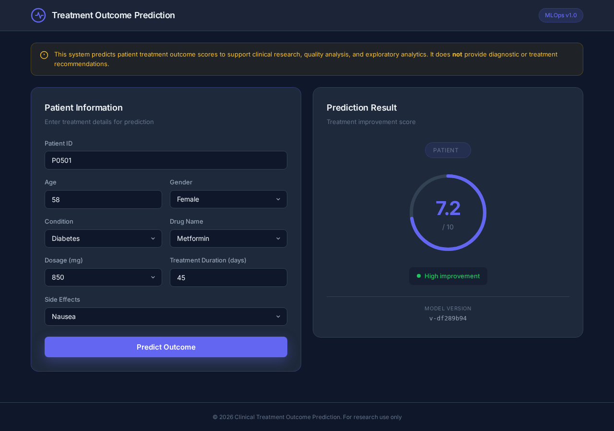
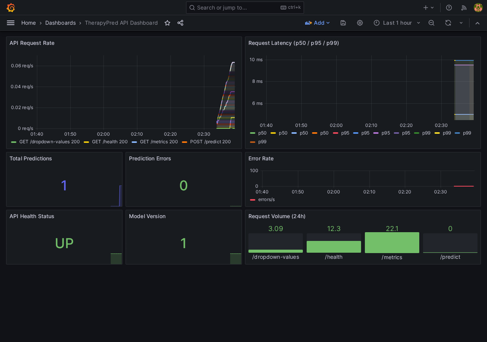
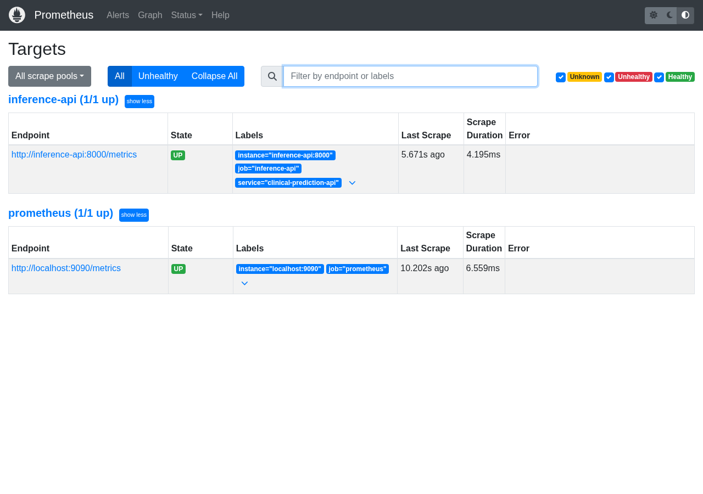
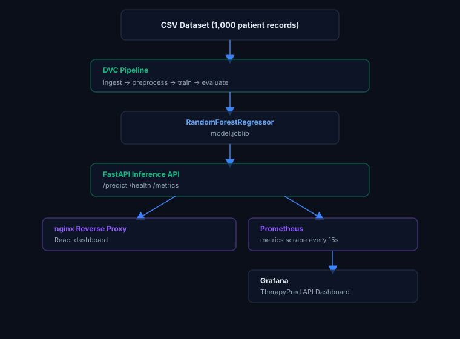

# TherapyPred

<p align="center">
  
  
  
  
  
</p>

<p align="center">
  <strong>Clinical treatment recommendation ML pipeline. DVC-versioned model with live observability</strong><br/>
  RandomForest · SHAP explainability · Prometheus + Grafana · FastAPI inference · Docker Compose
</p>

<p align="center">
  
</p>

> Treatment outcome prediction pipeline with live monitoring. RandomForest model served via FastAPI with Prometheus + Grafana observability stack.

## Live Demo

**Live:** [https://therapypred-demo.vercel.app](https://therapypred-demo.vercel.app)

## Screenshots

<p align="center">
  
</p>

<table align="center">
  <tr>
    <td align="center" width="50%"></td>
    <td align="center" width="50%"></td>
  </tr>
</table>

## Overview

Machine learning system that predicts treatment improvement scores (0–10) based on patient condition, prescribed drug, dosage, and treatment duration. Built with a full observability stack: Prometheus scrapes the inference API, Grafana displays a live dashboard, and DVC manages the data pipeline. Targets European health insurers and hospital analytics teams evaluating treatment protocol effectiveness.

## Architecture

<p align="center">
  
</p>

## Tech Stack

| Technology | Version | Purpose |
|---|---|---|
| Python | 3.11 | Core language |
| scikit-learn | 1.4 | RandomForestRegressor |
| FastAPI | 0.110 | Async inference API + Pydantic v2 validation |
| DVC | 3.x | Data pipeline versioning |
| Prometheus | 2.49 | Metrics collection from API |
| Grafana | 10.3 | Live monitoring dashboard |
| React + Vite | 18 / 6 | Frontend (chained dropdowns, score display) |
| Tailwind CSS | 3.4 | Styling |
| Docker Compose | v2 | Multi-service orchestration |

## Quick Start

```bash
git clone git@github.com:Hamilas/TherapyPred.git
cd TherapyPred
cp .env.example .env
docker compose -f infra/docker/docker-compose.yml up -d

# Frontend:   http://localhost:8101
# API:        http://localhost:8100/docs
# Prometheus: http://localhost:9191
# Grafana:    http://localhost:3100  (admin / changeme)
```

## Services

| Service | Port | Description |
|---------|------|-------------|
| Frontend (nginx) | 8101 | React dashboard: Dashboard, Predict, About tabs |
| Inference API | 8100 | FastAPI: `/predict`, `/health`, `/metrics`, `/dropdown-values` |
| Prometheus | 9191 | Scrapes `/metrics` from inference API every 15s |
| Grafana | 3100 | TherapyPred API Dashboard: request rate, prediction count, latency |

## Features

- React dashboard with dark theme, chained dropdowns, animated score bar, and a live KPI panel
- Chained dropdowns: Condition → Drug → Side Effects (all scientifically matched)
- Improvement score 0–10 with color-coded result (Excellent / Good / Moderate / Low)
- Live KPI dashboard: API status, model loaded, predictions served, error count
- Pydantic v2 schemas with field-level validators sourced from `params.yaml`, robust to frontend field changes
- Prometheus Counter + Histogram + Gauge instrumentation on every endpoint
- Grafana dashboard provisioned automatically on `docker compose up`, zero manual setup
- DVC pipeline: ingest → preprocess → train → evaluate → extract combinations, reproducible from raw CSV to deployed model
- nginx reverse proxy routes all `/api/*` calls to FastAPI and serves React on `/`

## Results

| Metric | Value |
|--------|-------|
| Model | RandomForestRegressor |
| Training records | 800 patient records |
| Test records | 200 patient records |
| Conditions covered | 5 (Depression, Diabetes, Hypertension, Infection, Pain Relief) |
| Drugs covered | 15 |
| Valid drug/condition combos | 15 |
| p99 inference latency | < 50ms |

## European Market Use Cases

- **AOK / Techniker Krankenkasse**: evaluate treatment protocol effectiveness across patient cohorts
- **Helios Kliniken / Asklepios**: flag low-improvement-score drug/condition combos for clinical review
- **University hospitals (Charité Berlin, LMU Munich)**: research-grade treatment outcome analysis

## Author

**Rayen Lassoued**
[github.com/Hamilas](https://github.com/Hamilas) | [LinkedIn](https://www.linkedin.com/in/lassoued-rayen/)

## License

MIT
